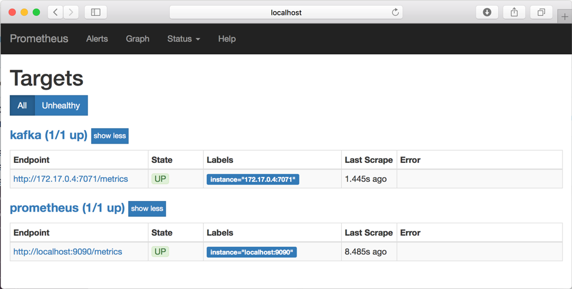

# Monitoring Kafka with Prometheus and Grafana

A comprehensive Kafka monitoring plan should collect metrics from the following components:

* Kafka Broker(s)
* Kafka Cluster (which should include ZooKeeper metrics as Kafka relies on it to maintain its state)
* Producer(s) / Consumer(s) 

Kafka Broker, Zookeeper and Java clients (producer/consumer) expose metrics via JMX (Java Management Extensions) and can be configured to report stats back to Prometheus using the [JMX exporter](https://github.com/prometheus/jmx_exporter) maintained by Prometheus.  There is also a number of exporters maintained by the community to explore. Some of them can be used in addition to the JMX export. To monitor Kafka, for example, the JMX exporter is often used to provide broker level metrics, while community exporters claim to provide more accurate cluster level metrics (e.g. [Kafka exporter](https://github.com/danielqsj/kafka_exporter), [Kafka Zookeeper Exporter by CloudFlare](https://github.com/cloudflare/kafka_zookeeper_exporter), and others). Alternatively, you can consider [writing your own custom exporter](https://prometheus.io/docs/instrumenting/writing_exporters/).

## What to monitor

A long list of metrics is made available by Kafka ([here](https://kafka.apache.org/documentation/#monitoring)) and Zookeeper ([here](https://zookeeper.apache.org/doc/current/zookeeperJMX.html)). The easiest way to see the available metrics is to fire up *jconsole* and point it at a running kafka client or Kafka/Prometheus server; this will allow browsing all metrics with JMX. But you are still left to figure out which ones you want to actively monitor and the ones that you want to be actively alerted. 

An simple way to get started would be to start with the [Grafana’s sample dashboards](https://grafana.com/dashboards) for the Prometheus exporters you chose to use and then modify them as you learn more about the available metrics and/or your environment on ICP. The [Monitoring Kafka metrics](https://www.datadoghq.com/blog/monitoring-kafka-performance-metrics/) article from *DataDog* provides great guidance to some of the key Kafka and Prometheus metrics and why you should care about them. In the next section, we will demonstrate exactly that; we will start with sample dashboards and make few modifications to exemplify how to configure key Kafka metrics to display in the dashboard.

### Configuring server and agents

For convenience and easy configuration, we will use Docker images from DockerHub and make few modifications to Dockerfiles to include few additional steps to install, configure and start the servers and exporter agents.

#### Kafka and Zookeeper servers with JMX Exporter

We will start with the Dockerfile of the [Spotify kafka image](https://hub.docker.com/r/spotify/kafka/~/dockerfile/) from DockerHub as it includes Zookeeper and Kafka in a single image. The Dockerfile was modified as shown below to download, install and start Kafka with JMX exporter agent (port 7071) that will expose an /metrics endpoint to be used by Prometheus to scrape metrics from container. 

```
# Modified Kafka and Zookeeper Dockerfile from spotify/kafka

FROM java:openjdk-8-jre

ENV DEBIAN_FRONTEND noninteractive
ENV SCALA_VERSION 2.11
ENV KAFKA_VERSION 0.10.2.2
ENV KAFKA_HOME /opt/kafka_"$SCALA_VERSION"-"$KAFKA_VERSION"

# Install Kafka, Zookeeper and other needed things
RUN apt-get update && \
    apt-get install -y zookeeper wget supervisor dnsutils vim && \
    rm -rf /var/lib/apt/lists/* && \
    apt-get clean && \
    wget -q http://apache.mirrors.spacedump.net/kafka/"$KAFKA_VERSION"/kafka_"$SCALA_VERSION"-"$KAFKA_VERSION".tgz -O /tmp/kafka_"$SCALA_VERSION"-"$KAFKA_VERSION".tgz && \
    tar xfz /tmp/kafka_"$SCALA_VERSION"-"$KAFKA_VERSION".tgz -C /opt && \
    rm /tmp/kafka_"$SCALA_VERSION"-"$KAFKA_VERSION".tgz

ADD scripts/start-kafka.sh /usr/bin/start-kafka.sh
# ADD scripts/jmx_prometheus_javaagent-0.9.jar "$KAFKA_HOME"/jmx_prometheus_javaagent-0.9.jar
# ADD scripts/kafka-0-8-2.yml "$KAFKA_HOME"/kafka-0-8-2.yml

# Supervisor config
ADD supervisor/kafka.conf supervisor/zookeeper.conf /etc/supervisor/conf.d/

# 2181 is zookeeper, 9092 is kafka
EXPOSE 2181 9092

# start - modifications to run Prometheus JMX exporter and community Kafka exporter agents
ENV KAFKA_OPTS "-javaagent:$KAFKA_HOME/jmx_prometheus_javaagent-0.9.jar=7071:$KAFKA_HOME/kafka-0-8-2.yml"

RUN wget -q https://repo1.maven.org/maven2/io/prometheus/jmx/jmx_prometheus_javaagent/0.9/jmx_prometheus_javaagent-0.9.jar -O /tmp/jmx_prometheus_javaagent-0.9.jar && \
    wget -q https://raw.githubusercontent.com/prometheus/jmx_exporter/master/example_configs/kafka-0-8-2.yml -O /tmp/kafka-0-8-2.yml && \
    mv -f /tmp/jmx_prometheus_javaagent-0.9.jar "$KAFKA_HOME"/ && \
    mv -f /tmp/kafka-0-8-2.yml "$KAFKA_HOME"/

EXPOSE 7071
# end - modifications

CMD ["supervisord", "-n"]
```

For your convenience, the modified Dockerfile and scripts are available on this [GitHub repository](https://github.com/anagiordano/ibm-artifacts). You can run the following commands to create and run the container locally.

```
# download git repo with Dockerfile and scripts

mkdir /tmp/monitor
git clone https://github.com/anagiordano/ibm-artifacts.git /tmp/monitor/.

# build image 
docker build --tag kafka_i /tmp/monitor/kafka/.

# create container
docker run -d -p 2181:2181 -p 9092:9092 -p 7071:7071 --env ADVERTISED_PORT=9092 --name kafka_c kafka_i 

# create kafka topics
docker exec -it kafka_c /bin/bash
cd /opt/kafka*/bin
export KAFKA_OPTS=""
./kafka-topics.sh --create --zookeeper localhost:2181 --replication-fact 1 --partitions 1 --topic my-topic1
./kafka-topics.sh --create --zookeeper localhost:2181 --replication-fact 1 --partitions 1 --topic my-topic2
./kafka-topics.sh --list --zookeeper localhost:2181

# (optional) produce few message into topic from console
./kafka-console-producer.sh --broker-list localhost:9092 --topic my-topic1
./kafka-console-producer.sh --broker-list localhost:9092 --topic my-topic2

# exit container
exit
``` 
Lastly you can validate that the /metrics endpoint is returning metrics from Kafka. On a browser, open the http://localhost:7071/metrics URL.


#### Prometheus Server and scrape jobs

1- Obtain the IP address of the Kafka container

```
docker inspect kafka_c | grep IPAddress
```

2- Edit the prometheus.yml to add Kafka as a target

```
docker exec -it prometheus_c \sh
vi /etc/prometheus/prometheus.yml
```
```
# add the following lines at the bottom of the file (scrape_configs: section), 
# where the IP should be the IP of the kafka container 

  - job_name: 'kafka'                                                          
                                                                               
    static_configs:                                                            
    - targets: ['172.17.0.4:7071'] 

```
3- Restart Prometheus to reload the configuration file

```
ps -ef 
kill -HUP <prometheus PID>
```

4- You can now verify that Kafka is listed as a target job in Prometheus. On a Browser, open the http://localhost:9090/targets URL.

